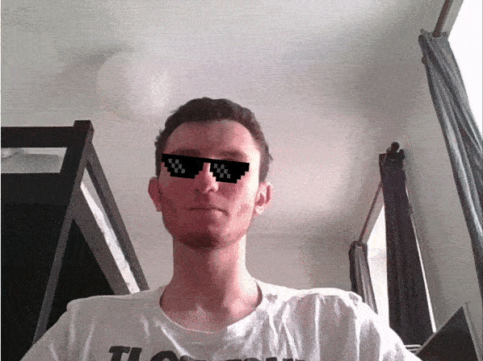

# Creating a mask with posenet and p5.js

## What's posenet ?

[Posenet](https://github.com/tensorflow/tfjs-models/tree/master/posenet) is a pre-trained neural network that can identify a person's position. It has multiple keypoints as nose, left-eye, right-hand, left-shoulder...

It can be useful for gesture recognition, artistic installation, or masks.

Here is an example of posenet (on their Github):

Posenet is available as a pre-trained model in Tensorflow, we'll importing it in tensorflow.js.